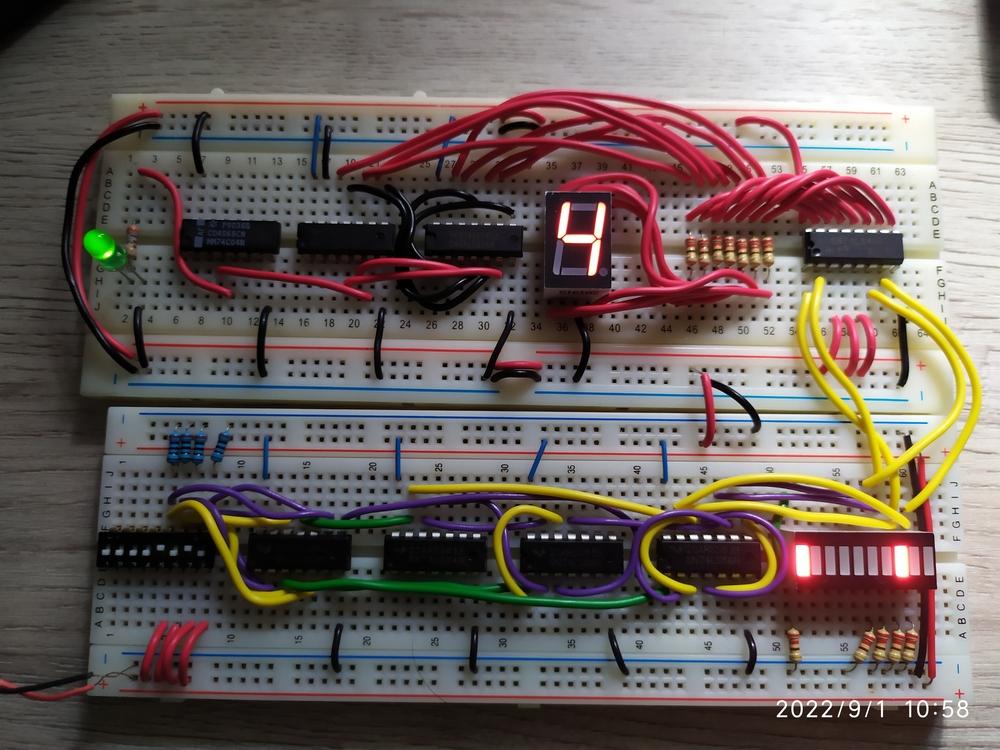
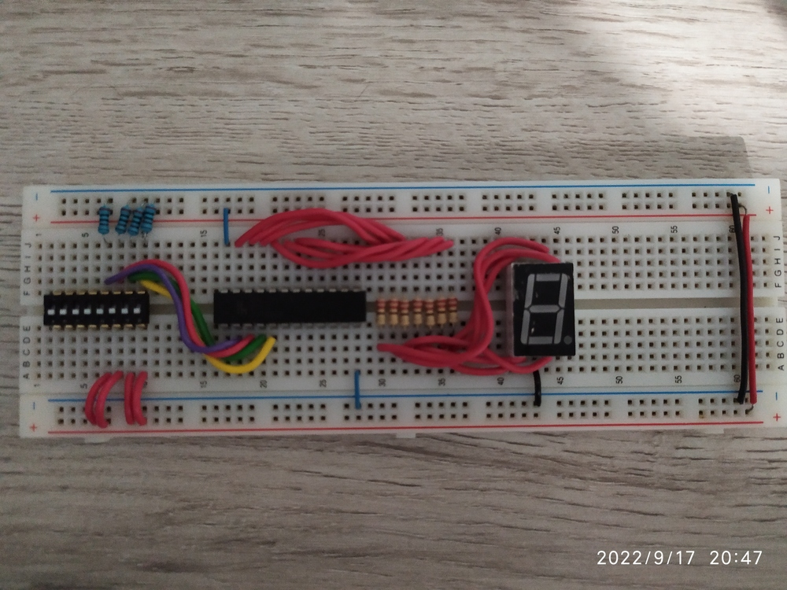
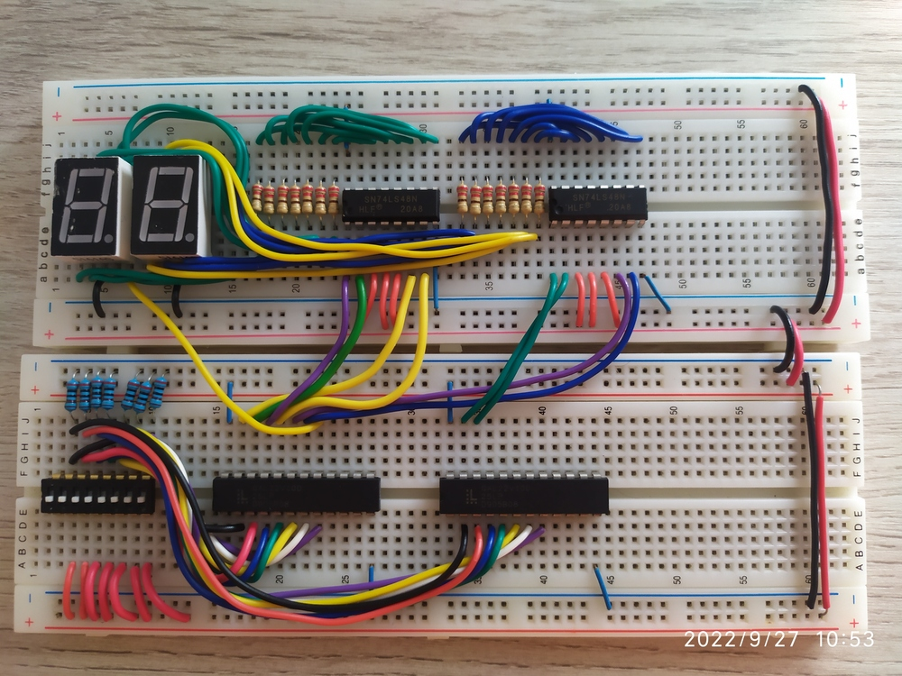
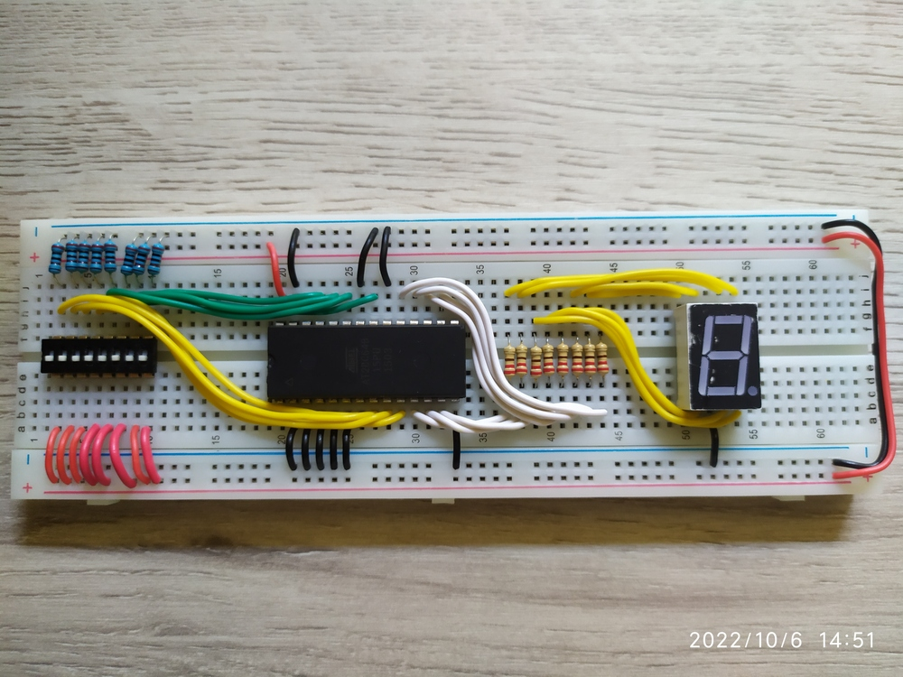
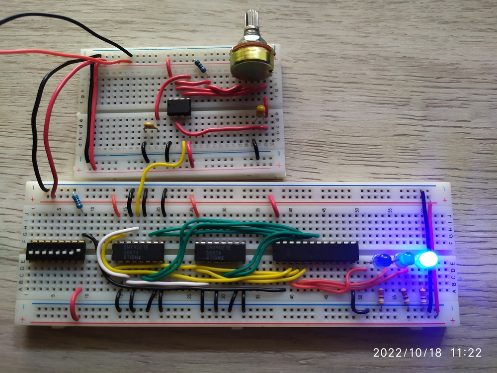
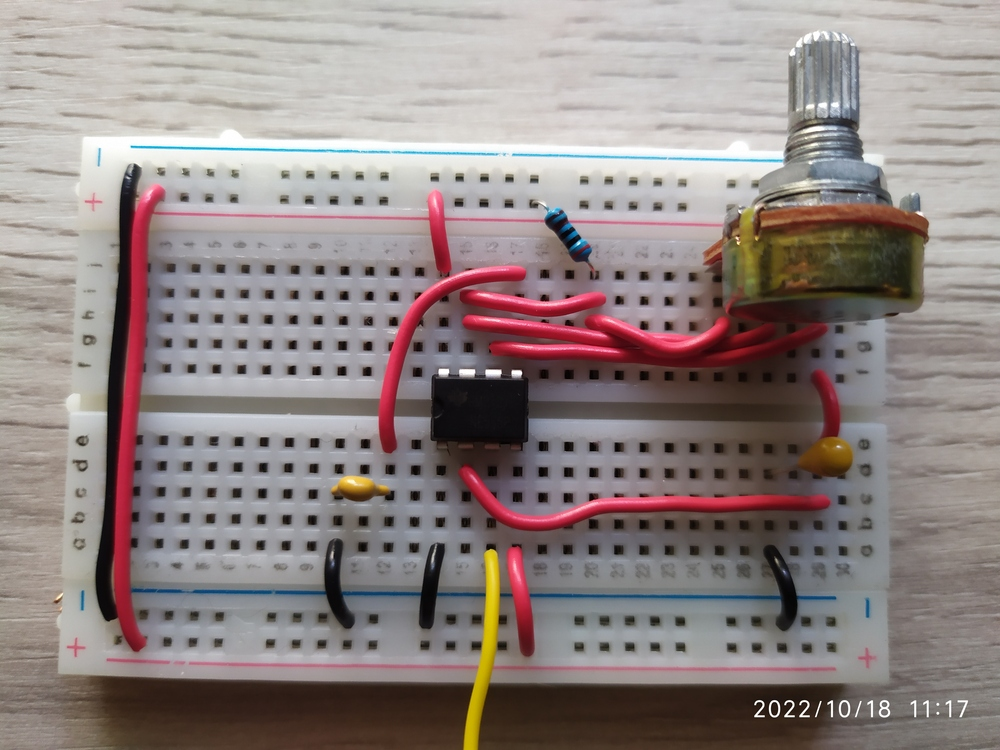
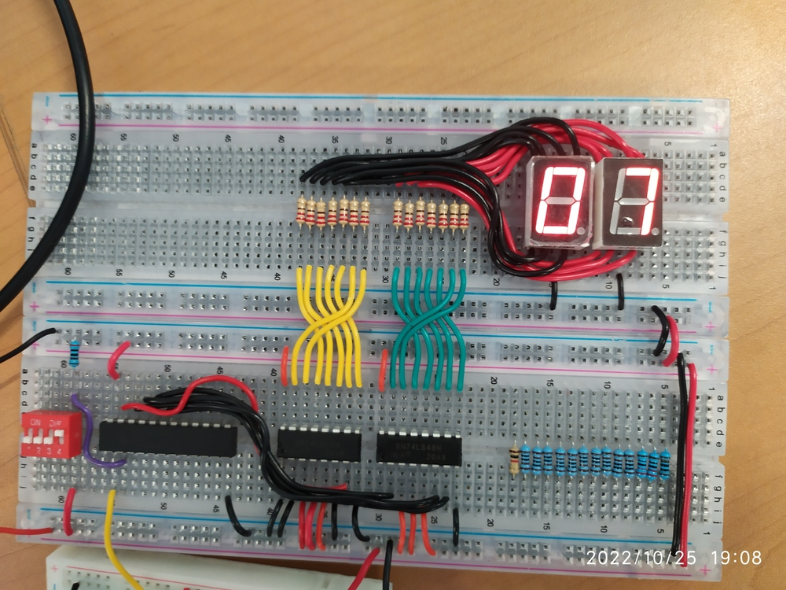
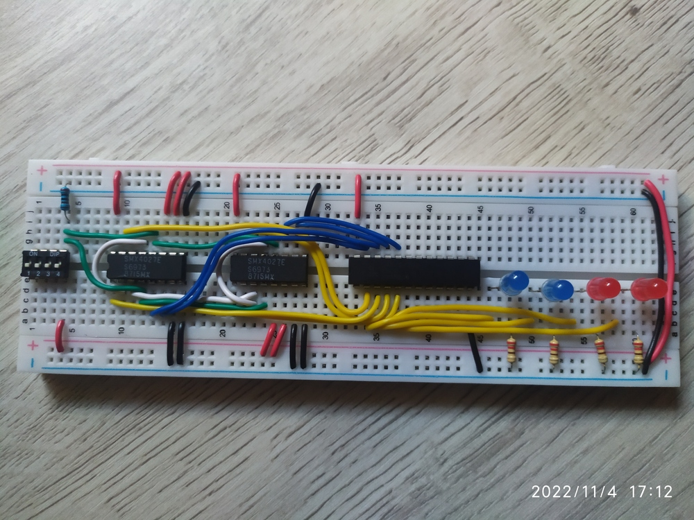
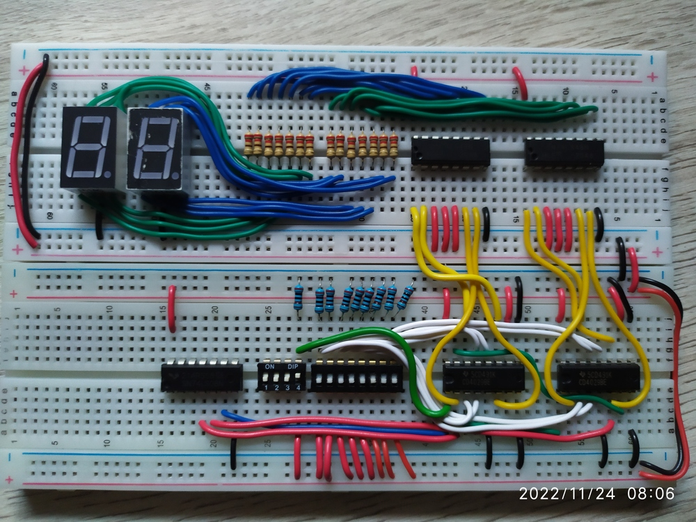
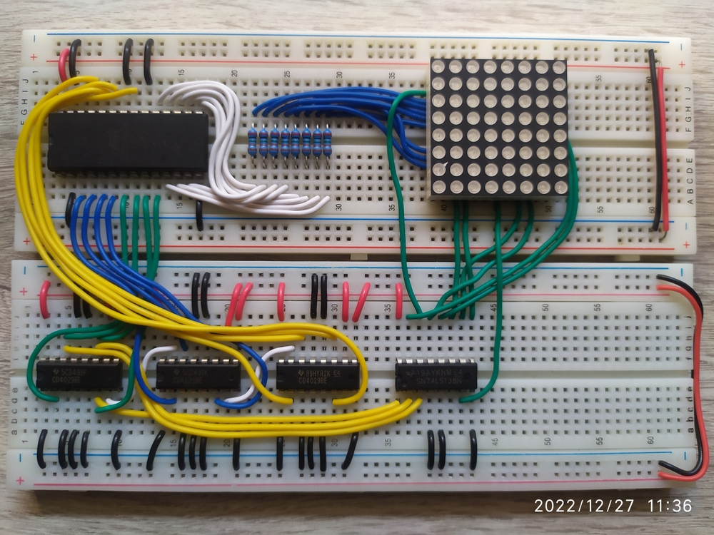

# Sistemas reconfigurables

## Software necesario

### Boole Deusto
Para obtener ecuaciones lógicas facilmente a partir de tabla de verdad o generar archivos
***jed*** para después cargarlos a las ***GAL (Generic Array Logic)***.

Se puede obtener en:

- [Deusto.es](https://weblab.deusto.es/website/boole_deusto.html)
- [GitHub.com](https://github.com/zstars/booledeusto)

### WinCUPL

Para escribir código ***PLD*** y generar archivos ***jed*** para programar las ***GAL***.

Se puede obtener en:

- [Microchip.com](https://www.microchip.com/en-us/products/fpgas-and-plds/spld-cplds/pld-design-resources)

### MaxLoader

Para generar archivo hexadecimales (***hex***) y binarios (***bin***), también para poder
cargar cualquier tipo de archivo (***bin***, ***hex***, ***jed***) a algún dispositivo.

Se puede obtener en:

- [MaxLoader](https://max-loader.software.informer.com/)

### CodeGraphics

Para diseñar figuras para una matriz led y obtener el valor hexadecimal, esto es útil
para el proyecto 11.

Se puede obtener en:

- [CodeGraphics](https://nickeugeny.com/2013/02/21/codegraphics-v2-1/)

### Proteus

Para simular los circuitos.

Se puede obtener en:

- [labcenter.com](https://www.labcenter.com/)

## Proyecto 1: Circuito lógico combinacional

    

En este proyecto se desarrollo un circuito lógico combinacional en el que se utilizaron
compuertas lógicas básicas como, ***and***, ***or*** y ***not***.

El objetivo del proyecto es diseñar un circuito combinacional para la función *ABCDE*
donde: ***F(A, B, C, D, E) = 1*** cuando ***ABD*** entre ***CE=Número impar***. Además,
cuando el resultado sea indeterminado o tenga fracción será igual a 0.

## Proyecto 2: Generador de bits de paridad

    

En este proyecto, se creo un generador de bits de paridad.

En la tira de leds se tiene un generador de paridad par, mientras que en el display de 7
segmentos se tiene un generador de paridad impar. Para el generador impar, al no funcionar
las compuertas ***xnor*** se eligió usar compuertas ***xor*** y agregar una compuerta
***not*** a la salida del generador, así se obtuvo el generador impar.

## Proyecto 3: Mensaje en display con compuertas lógicas

En este proyecto solo se hizo una simulación en ***Proteus*** para mostrar un mensaje en
un display de 7 segmentos usando solo compuertas lógicas.

## Proyecto 4: Mensaje en display con *GAL22V10D*

    

En este proyecto se hizo lo mismo que en la actividad anterior, pero esta vez usando una
***GAL22V10D***, la tabla de verdad para mostrar el mensaje es

|   | w | x | y | z | a | b | c | d | e | f | g |
|:-:|:-:|:-:|:-:|:-:|:-:|:-:|:-:|:-:|:-:|:-:|:-:|
| 5 | 0 | 0 | 0 | 0 | 1 | 0 | 1 | 1 | 0 | 1 | 1 |
| E | 0 | 0 | 0 | 1 | 1 | 0 | 0 | 1 | 1 | 1 | 1 |
| 3 | 0 | 0 | 1 | 0 | 1 | 1 | 1 | 1 | 0 | 0 | 1 |
| 1 | 0 | 0 | 1 | 1 | 0 | 1 | 1 | 0 | 0 | 0 | 0 |
| n | 0 | 1 | 0 | 0 | 0 | 0 | 1 | 0 | 1 | 0 | 1 |
| A | 0 | 1 | 0 | 1 | 1 | 1 | 1 | 0 | 1 | 1 | 1 |
| r | 0 | 1 | 1 | 0 | 0 | 0 | 0 | 0 | 1 | 0 | 1 |
| 1 | 0 | 1 | 1 | 1 | 0 | 1 | 1 | 0 | 0 | 0 | 0 |
| 0 | 1 | 0 | 0 | 0 | 1 | 1 | 1 | 1 | 1 | 1 | 0 |
| n | 1 | 0 | 0 | 1 | 0 | 0 | 1 | 0 | 1 | 0 | 1 |
| U | 1 | 0 | 1 | 0 | 0 | 1 | 1 | 1 | 1 | 1 | 0 |
| ñ | 1 | 0 | 1 | 1 | 1 | 0 | 1 | 0 | 1 | 0 | 1 |
| E | 1 | 1 | 0 | 0 | 1 | 0 | 0 | 1 | 1 | 1 | 1 |
| 2 | 1 | 1 | 0 | 1 | 1 | 1 | 0 | 1 | 1 | 0 | 1 |
|   | 1 | 1 | 1 | 0 | x | x | x | x | x | x | x |
|   | 1 | 1 | 1 | 1 | x | x | x | x | x | x | x |

## Proyecto 5: Divisor-Sumador

    

Para este proyecto se hizo un Divisor-Sumador con el que se hacen las ecuaciones lógicas
desde dos ***GAL22V10D***, después de tener el resultado en binario, este se convierte de
***BCD*** a 7 segmentos con un decodificador ***74LS48***.

## Proyecto 6: Uso de memoria *EEPROM*

    

En este proyecto se usó una memoria ***EEPROM AT28C64B*** para realizar distintas funciones,
se usan distintas páginas de esta memoria para acceder a cada funcionalidad, las opciones
son:

- Operaciones aritméticas (página 300).
- Código de estudiante (página 600).
- Nombre (página 900).
- Carrera  (página c00).

## Proyecto 7: Máquina de estados con *Flip-Flop 4027*

    

En este proyecto se usaron ***Flip-Flops 4027*** y una ***GAL22V10D*** para hacer una
máquina de estados.

Para esto y los siguientes proyectos, se hizo un reloj usando el circuito integrado
***LM555*** y así poder variar la frecuencia del reloj.

    

### Tabla de verdad para *Flip-Flop SR*
#### Nivel alto
| S | R | $$Q^t$$ | $$Q^{t+1}$$ |
|:-:|:-:|:-:|:-:|
| 0 | 0 | 0 | 0 |
| 0 | 0 | 1 | 1 |
| 0 | 1 | 0 | 0 |
| 0 | 1 | 1 | 0 |
| 1 | 0 | 0 | 1 |
| 1 | 0 | 1 | 1 |
| 1 | 1 | 0 | X |
| 1 | 1 | 1 | X |
#### Nivel bajo
| S | R | $$Q^t$$ | $$Q^{t+1}$$ |
|:-:|:-:|:-:|:-:|
| 0 | 0 | 0 | X |
| 0 | 0 | 1 | X |
| 0 | 1 | 0 | 1 |
| 0 | 1 | 1 | 1 |
| 1 | 0 | 0 | 0 |
| 1 | 0 | 1 | 0 |
| 1 | 1 | 0 | 0 |
| 1 | 1 | 1 | 1 |

### Tabla de verdad para *Flip-Flop D*
| D | $$Q^t$$ | $$Q^{t+1}$$ |
|:-:|:-:|:-:|
| 0 | 0 | 0 |
| 0 | 1 | 0 |
| 1 | 0 | 1 |
| 1 | 1 | 1 |

### Tabla de verdad para *Flip-Flop T*
| T | $$Q^t$$ | $$Q^{t+1}$$ |
|:-:|:-:|:-:|
| 0 | 0 | 0 |
| 0 | 1 | 1 |
| 1 | 0 | 1 |
| 1 | 1 | 0 |

### Tabla de verdad para *Flip-Flop JK*
| CK | J | K | $$Q^t$$ | $$Q^{t+1}$$ |
|:-:|:-:|:-:|:-:|:-:|
| 0 | 0 | 0 | 0 | 0 |
| 0 | 0 | 0 | 1 | 1 |
| 0 | 0 | 1 | 0 | 0 |
| 0 | 0 | 1 | 1 | 1 |
| 0 | 1 | 0 | 0 | 0 |
| 0 | 1 | 0 | 1 | 1 |
| 0 | 1 | 1 | 0 | 0 |
| 0 | 1 | 1 | 1 | 1 |
| 1 | 0 | 0 | 0 | 0 |
| 1 | 0 | 0 | 1 | 1 |
| 1 | 0 | 1 | 0 | 0 |
| 1 | 0 | 1 | 1 | 0 |
| 1 | 1 | 0 | 0 | 1 |
| 1 | 1 | 0 | 1 | 1 |
| 1 | 1 | 1 | 0 | 1 |
| 1 | 1 | 1 | 1 | 0 |

### Tabla de activación de las Flip-Flops
| $$Q^t$$ | $$Q^{t+1}$$ | S | R | J | K | T | D |
|:-:|:-:|:-:|:-:|:-:|:-:|:-:|:-:|
| 0 | 0 | 0 | X | 0 | X | 0 | 0 |
| 0 | 1 | 1 | 0 | 1 | X | 1 | 1 |
| 1 | 0 | 0 | 1 | X | 1 | 1 | 0 |
| 1 | 1 | X | 0 | X | 0 | 0 | 1 |

## Proyecto 8: Contador asíncrono

    

Para este proyecto, se usó una ***GAL22V10D*** que tiene como salida los resultados de
las funciones lógicas y como entrada tiene una señal de reloj y una entrada que puede ser
0 o 1, esto para elegir la secuencia, por tanto, solo hay dos secuencias.

| x | Secuencia |
|:-:|:-:|
| 0 | 1, 2, 3, 4, 6, 8, 9, 12, 13, 14, 15 |
| 1 | 15, 13, 11, 9, 7, 5, 3, 1 |

Todos estos valores pasan por dos decodificadores ***74LS48*** para mostrarlos en un
display.

## Proyecto 9: Contador asíncrono del 0 al 9

    

En este proyecto se usaron 4 ***Flip-Flops 4027*** para generar el contador, aunque esta
vez no se usa el código ***BCD (8, 4, 2, 1)***, si no el ***BCD (8, 4, -2, -1)***

### Código *BCD (8, 4, -2, -1)* del 0 al 9
| | 8 | 4 | -2 | -1 |
|:-:|:-:|:-:|:-:|:-:|
| 0 | 0 | 0 | 0 | 0 |
| 1 | 0 | 1 | 1 | 1 |
| 2 | 0 | 1 | 1 | 0 |
| 3 | 0 | 1 | 0 | 1 |
| 4 | 0 | 1 | 0 | 0 |
| 5 | 1 | 0 | 1 | 1 |
| 6 | 1 | 0 | 1 | 0 |
| 7 | 1 | 0 | 0 | 1 |
| 8 | 1 | 0 | 0 | 0 |
| 9 | 1 | 1 | 1 | 1 |

## Proyecto 10: Contadores en cascada

    

Para este proyecto se usaron dos contadores ***4029***, una compuerta ***and** y dos
decodificadores ***74LS48*** para mostrar los valores en 2 displays de 7 segmentos.

## Proyecto 11: Animación en matriz led

    

En este proyecto se esperaba mostrar una animación en una matriz led usando 3  contadores
***4029*** para poder acceder a las distintas dirección de memoria de la
***EEPROM AT28C64B***, y así, tener una salida esperada de la memoria ***ROM***, además
se usó un demultiplexor ***74LS138*** para poder sincronizar las salidas de la memoria
y que se muestre la animación correctamente.

El circuito no se logró implementar en físico debido a un problema al programar la
***ROM***.
